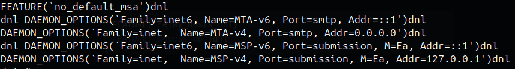

## Pengertian SendMail
SendMail adalah sebuah program yang digunakan untuk mengirimkan email dari server ke server lainnya menggunakan protokol **SMTP** *(Simple Mail Transfer Protocol)*.

## Instalasi SendMail
Dalam environment ini kita akan menggunakan Ubuntu sebagai sistem operasi. Untuk menginstall `SendMail`, kita dapat menggunakan perintah berikut:
```bash
sudo apt install sendmail sendmail-bin mailutils -y
```

Setelah proses instalasi selesai, kita dapat memulai konfigurasi **SendMail** dengan mengedit file konfigurasi `sendmail.mc` yang terletak di `/etc/mail/sendmail.mc`.

```bash
sudo nano /etc/mail/sendmail.mc
```

Tambahkan baris berikut di dalam file konfigurasi `sendmail.mc`:
```bash
FEATURE(`relay_hosts_only')dnl
FEATURE(`access_db')dnl
```
dan juga cari baris berikut:


> DAEMON_OPTIONS(`Family=inet,  Name=MTA-v4, Port=smtp, Addr=0.0.0.0')dnl


Ubah baris `Addr` menjadi `0.0.0.0` agar server dapat menerima email dari luar.


Setelah itu tambahkan baris kode di file `/etc/mail/access`:
```bash
Connect:192.168.100 RELAY
```
 
 Jika IP server berbeda, asumsikan ip server adalah `192.168.100.99` maka ganti `192.168.100` dengan IP server yang digunakan.
 

Dan jalankan perintah berikut:
```bash
sudo makemap hash /etc/mail/access.db < /etc/mail/access
```

Setelah konfigurasi selesai, kita dapat melakukan langkah berikut:
```bash
sudo sendmailconfig
```
> Ketika ada pertanyaan, tekan `Y` untuk melanjutkan.

## Testing SendMail
Sebelum melakukan testing, pastikan hostname server sudah diatur dengan benar. Untuk melakukan testing, kita dapat menggunakan perintah berikut:
```bash
hostnamectl #check hostname
sudo hostnamectl set-hostname mail.local #ubah nama hostname (Bebas)
```

Kita akan menggunakan host `mail.local` sebagai contoh. Setelah itu, kita dapat melakukan testing dengan perintah berikut:
```bash
sudo nano /etc/hosts
```
Tambahkan baris berikut:
```bash
192.168.100.99 mail.local
```
> Ganti `192.168.1.X` dengan IP server yang digunakan. Kalau Kasus ini IP server adalah `192.168.100.99`
> check IP server dengan perintah `ip a`

Beres! sekarang kita dapat melakukan testing dengan perintah berikut:
```bash
sudo systemctl restart sendmail
sudo systemctl enable sendmail
sudo systemctl start sendmail
```

Konfirmasi Hostname via `nslookup`:
```bash
nslookup mail.local 
```
 
 Test koneksi PC dengan server `telnet 192.168.100.99 25`
 

Testing sendmail ke diri sendiri dengan perintah berikut:
```bash
echo "Test email" | mail -s "Subject: Test Email" ubuntu@mail.local
```

Check hasil pengiriman email di `/var/mail/`
```bash
cd /var/mail/
cat (nama user yang ingin dicek) 
```

Jika ingin melihat proses pengiriman email (DEBUG), kita dapat menggunakan perintah berikut:
```bash
sudo tail -f /var/log/mail.log
```

## Kesimpulan
Dengan demikian, kita telah berhasil mengkonfigurasi **SendMail** pada server Linux. Dengan konfigurasi ini, server dapat mengirimkan email ke server lainnya. Mungkin ada beberapa konfigurasi tambahan yang perlu dilakukan tergantung kebutuhan server. 
